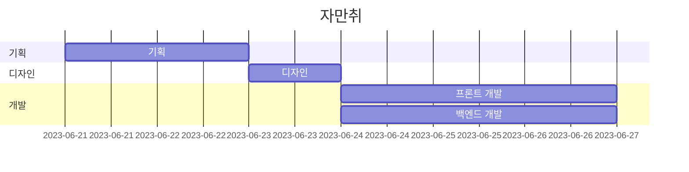

## 프로젝트 소개

배포링크 : https://jamanchi.netlify.app/

우리는 삶 속에서 즐거움과 만족감을 찾기 위해 언제나 새로운 도전을 하고 있습니다. 그 중에서도 취미생활은 우리에게 힐링과 창조적인 재미를 선사하는 특별한 시간입니다. 하지만 종종 우리는 어떤 취미를 선택해야 할지 망설이기도 하고, 주변의 정보가 부족하여 적합한 취미를 찾기 어렵기도 합니다.

이러한 고민에서 시작되어 ‘**자만취(자연스럽게 만나는 취미생활)**’ 서비스를 기획하게 되었습니다.

**자만취**는 사용자들에게 가장 적합한 취미를 추천해주고, 그 취미에 대한 다양한 정보를 제공하여 조금 더 쉽게 취미를 즐길 수 있도록 도와줍니다.

어떤 유형의 사람이든 상관없이, **자만취**는 서비스 이용자들을 위해 최적화된 취미 추천 시스템을 제공합니다. 저희 플랫폼은 사용자분들의 성향, 활동정도, 예산 등을 고려하여 개인 맞춤형 추천을 제공하며, 이용자분들이 진정으로 즐길 수 있는 취미를 발견하는 데 도움을 줄 것입니다.

뿐만 아니라, **자만취**는 추천된 취미에 대한 풍부한 정보와 자료를 제공합니다. 서비스 이용자가 선택한 취미의 기초 지식부터 전문적인 팁과 요령, 비슷한 취미, 관련 유명 선수 정보까지 모두 제공됩니다. 이를 통해 이용자들은 취미를 보다 다양하게 탐구하고 즐길 수 있습니다.

우리는 취미를 통해 일상의 스트레스를 해소하고 새로운 즐거움을 찾는 데 도움을 주고자 합니다. **자만취**는 여러분의 삶에 즐거움과 의미를 더할 것입니다. 우리의 서비스를 통해 여러분은 자신에게 맞는 취미를 찾아나갈 수 있으며, 그 안에서 일상의 행복을 느끼시길 희망합니다.

## 팀원소개

|                             디아                             |                             선                              |                             말티푸                             |                             머지                             |      레이크                                                      |
| :------------------------------------------------------------: | :-------------------------------------------------------------: | :------------------------------------------------------------: | :------------------------------------------------------------: |:------------------------------------------------------------: |
|  |   |  |  |  |
| 프론트 <a href="https://github.com/Ryan-Dia">[ Ryan-Dia ] </a> | 백엔드 <a href="https://github.com/SBSun">[ SBSun ] </a> | 백엔드 <a href="https://github.com/maltepoo">[ maltepoo ]</a> |프론트 <a href="https://github.com/kimseongchan-kr">[ kimseongchan ]</a> | 프론트 <a href="https://github.com/tnghgks">[ HOSU ]</a>    |

## 기술스택

**백엔드**
Spring Boot, Spring Data JPA, QueryDSL, openAI, Google Clould Storage, Lombok, MariaDB, CloudType

**프론트 엔드**
React, TypeScript , React-Query, @emotion , msw

## 개발기간

`기획 및 설계` : 2023.06.21 ~ 2023.06.23

`개발` : 2023.06.24 ~ 2023.06.26



## **기능 시연**

|                                                           메인 화면                                                          |
| :---------------------------------------------------------------------------------------------------------------------------: |
|  |


### 메인 화면

- 새로운 취미 또는 시작하려고 하는 취미에 대한 정보를 얻을 수 있어요!
- 새로운 취미를 시작하고는 싶은데, 어떤 취미가 나에게 맞을지 몰라 고민 중이라면 **새로운 취미 만나러 가기**를 눌러주세요!
- 즐기려는 취미에 대한 자세한 정보를 더 얻고 싶다면 **다양한 취미 만나기**를 눌러주세요!

|                                                           취미 리스트                                                          |
| :---------------------------------------------------------------------------------------------------------------------------: |
|  |


### 취미 리스트(새로운 취미 만나러 가기)

- 즐기려는 취미를 리스트에서 찾아 누르시면, 해당하는 취미의 자세한 정보를 얻을 수 있어요!

|                                                          질문 페이지                                                       |                                                         질문 페이지                                                      |                                                          질문 페이지                                                           |
| :---------------------------------------------------------------------------------------------------------------------------: | :---------------------------------------------------------------------------------------------------------------------------: | :---------------------------------------------------------------------------------------------------------------------------: |
|  |  |  |


### 질문 페이지(다양한 취미 만나기)

- 아직 새로운 취미를 만나지 못했다면 질문을 통해 나의 취향에 맞는 취미를 찾아보세요!
- 분명 멋진 취미를 찾으실 수 있을 거에요!

|                                                           키워드 페이지                                                          |
| :---------------------------------------------------------------------------------------------------------------------------: |
|  |

### 키워드 페이지(공통)

- 취미를 고르셨다면, 키워드를 통해 내가 더 알아가고 싶은 정보를 자세하게 받아보세요!

|                                                           결과 페이지                                                          |
| :---------------------------------------------------------------------------------------------------------------------------: |
|  |


### 결과 페이지(공통)

- 선택한 키워드에 따라 분류된 정보를 받고, 주변 친구들과 나눠 같이 취미를 즐겨보세요!
- 또 선택한 취미와 비슷한 취미를 확인해 보실 수 있어요!

## **폴더구조**

```jsx
📦src/main/java/com/jamanchi
 ┣ 📂 answer
 ┃ ┗ 📂dto
 ┣ 📂commons
 ┃ ┗ 📂dto
 ┣ 📂config
 ┣ 📂hobby
 ┃ ┗ 📂dto
 ┣ 📂keyword
 ┃ ┗ 📂dto
 ┣ 📂question
 ┃ ┗ 📂dto
 ┣ 📂summary
 ┗ ┗ 📂dto
```
